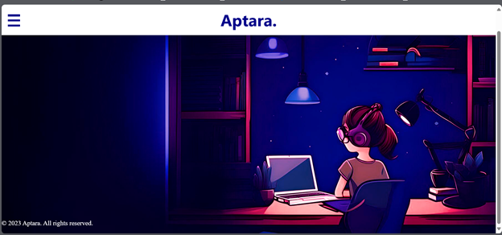
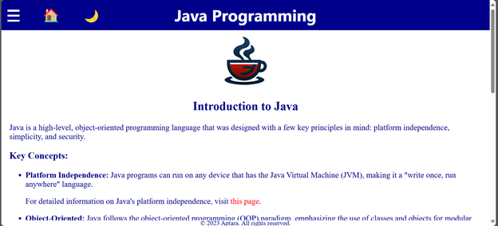
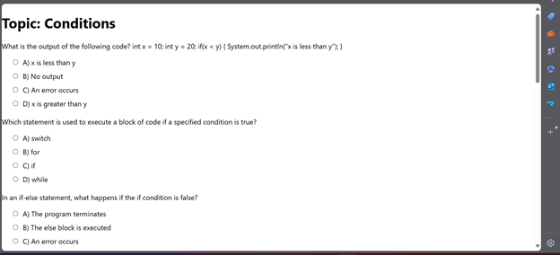

# 🎓 Educational Platform

An interactive quiz-based web application developed as part of a BSc Computer Science thesis project. The platform is designed to help students reinforce their knowledge through quizzes on subjects like Data Structures, Algorithms, Python, and Java.

## 🚀 Features

- User authentication and session management
- Create, delete, and take quizzes
- Score tracking
- Responsive UI for an accessible experience across devices

## 🛠️ Tech Stack

| Area        | Tools & Technologies                  |
|-------------|----------------------------------------|
| Frontend    | HTML, CSS, JavaScript, React           |
| Backend     | Node.js, Express.js                    |
| Database    | MySQL                                  |
| API Testing | Postman                                |

## 📸 Screenshots

### Homepage

### Course Page

### Quiz Page

